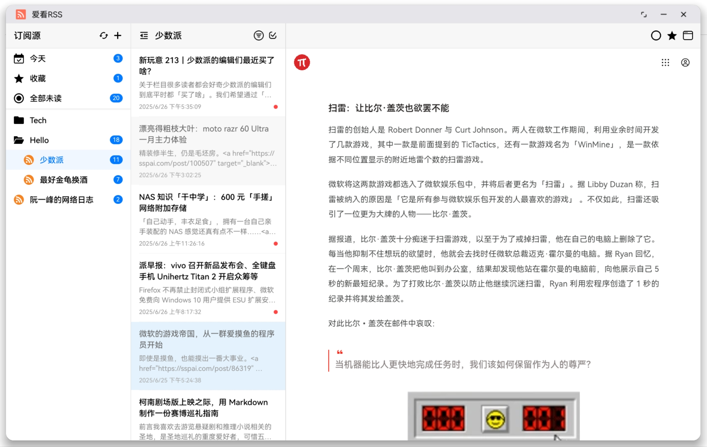

# HarmonyOS RSS阅读器

一款专为HarmonyOS设计的现代化RSS阅读器，采用三栏式布局，提供专业级的RSS内容管理和阅读体验。

## 📸 应用截图

<div align="center">
  
</div>

<div align="center">
  <sub>主界面三栏布局</sub>
</div>

## ✨ 核心功能

### 📱 现代化界面设计
- **三栏式布局**：RSS源列表、文章列表、文章详情三栏并列显示
- **可折叠侧边栏**：支持一键隐藏RSS源列表，进入专注阅读模式
- **响应式布局**：适配不同屏幕尺寸，提供最佳用户体验
- **实时未读数量显示**：RSS源、文件夹和特殊分类均显示未读文章数

### 🗂️ 高级组织管理
- **文件夹分组**：支持创建、重命名、删除文件夹，RSS源可拖拽分组
- **智能分类标签**：
  - 📅 **今天**：自动筛选当日发布的文章
  - ⭐ **收藏**：已收藏的重要文章
  - 📰 **全部未读**：所有未读文章聚合显示
- **右键上下文菜单**：RSS源和文件夹支持完整的右键操作

### 🔄 智能内容同步
- **多格式RSS解析**：完整支持RSS 2.0、Atom 1.0、JSON Feed、RSS in JSON
- **自动内容获取**：应用启动时自动同步，支持10分钟间隔定时刷新
- **手动刷新控制**：单个RSS源或全量刷新，带进度指示器
- **网络重试机制**：失败重试，确保内容获取稳定性
- **并发同步**：最多3个RSS源并发获取，提升同步效率

### 📖 专业阅读体验
- **文章状态管理**：已读/未读状态跟踪，支持一键标记全部已读
- **收藏系统**：重要文章可收藏保存，独立分类查看
- **过滤显示**：支持仅显示未读文章的筛选模式
- **原文链接**：一键跳转文章原始页面

### 💾 数据持久化
- **完整的数据库架构**：基于RelationalStore的专业数据存储
- **状态保存**：界面布局、选中源、阅读进度自动保存
- **数据完整性**：关联外键、事务处理确保数据一致性

### 🔍 全文搜索系统
- **智能搜索索引**：自动为文章标题、内容、摘要建立搜索索引
- **多字段搜索**：支持标题、正文、摘要的模糊匹配搜索
- **实时搜索结果**：搜索结果实时更新，支持高亮显示
- **搜索历史记录**：自动保存搜索历史，快速重复搜索

### 📤 数据导入导出
- **OPML格式支持**：完整支持OPML 1.0和2.0格式
- **一键导出订阅**：将所有RSS源和文件夹结构导出为OPML文件
- **批量导入订阅**：从OPML文件批量导入RSS源，自动创建文件夹结构
- **智能去重处理**：导入时自动检测重复RSS源，避免重复添加

### 🎨 图标管理系统
- **自动图标下载**：RSS源添加时自动下载网站图标
- **多格式支持**：支持ICO、PNG、JPG等多种图标格式
- **智能图标检测**：自动检测网站favicon、apple-touch-icon等
- **本地图标缓存**：图标本地存储，离线时正常显示
- **手动图标设置**：支持手动设置自定义图标URL

## 🛠️ 技术架构

### 开发环境
- **HarmonyOS SDK**: 5.0.5(17)
- **开发语言**: TypeScript/ArkTS
- **架构模式**: Stage模式
- **应用版本**: 1.1.2
- **Bundle ID**: com.mznm.iloverss

### 数据库设计
采用专业的关系型数据库设计，包含以下核心表：
- **feeds**：RSS订阅源信息
- **folders**：文件夹分组
- **articles**：文章内容
- **statuses**：文章状态（已读/收藏）
- **authors**：作者信息及关联
- **search**：全文搜索索引表

### RSS解析引擎
- **统一解析接口**：支持XML（RSS/Atom）和JSON格式
- **类型自动检测**：智能识别不同的Feed格式
- **错误容错处理**：解析失败时的优雅降级
- **内容清理**：HTML标签过滤和内容安全处理
- **解析器模块化**：
  - `AtomParser`: Atom 1.0格式解析
  - `RSSParser`: RSS 2.0格式解析  
  - `JSONFeedParser`: JSON Feed格式解析
  - `RSSInJSONParser`: RSS in JSON格式解析

### 搜索系统架构
- **搜索索引表**：独立的search表存储文章搜索数据
- **自动索引更新**：文章增删改时自动更新搜索索引
- **多字段索引**：为标题、正文建立独立索引提升搜索性能
- **模糊匹配**：支持LIKE查询实现模糊搜索

### 状态管理
- **响应式数据绑定**：@State装饰器实现自动UI更新
- **组件间通信**：完整的回调机制确保数据一致性
- **偏好设置持久化**：用户设置自动保存与恢复

## 🚀 快速开始

### 系统要求
- **操作系统**：HarmonyOS NEXT 或 HarmonyOS 4.0+
- **SDK版本**：5.0.5(17) 及以上
- **网络连接**：需要网络连接以同步RSS内容
- **存储空间**：建议预留100MB用于文章缓存

### 安装部署

#### 方式一：源码编译
1. **环境准备**
   ```bash
   # 确保已安装DevEco Studio 5.0+
   # 配置HarmonyOS SDK 5.0.5(17)
   ```

2. **获取源码**
   ```bash
   git clone [项目地址]
   cd iloverss
   ```

3. **依赖安装**
   ```bash
   # 使用hvigor构建工具
   hvigor clean
   hvigor assembleHap
   ```

4. **运行调试**
   - 在DevEco Studio中打开项目
   - 连接HarmonyOS设备或启动模拟器
   - 点击运行按钮进行安装调试

#### 方式二：HAP包安装
1. 下载预编译的HAP安装包
2. 通过hdc工具安装：
   ```bash
   hdc install iloverss.hap
   ```

### 基本操作
1. **RSS源管理**：
   - 右键RSS源 → 添加订阅，输入RSS地址
   - 拖拽到文件夹进行分组
   - 右键菜单支持复制、移动、删除

2. **文件夹管理**：
   - 右键空白处 → 添加文件夹
   - 双击文件夹名称进行重命名
   - 文件夹可展开/折叠，显示内含RSS源

3. **阅读体验**：
   - 点击文章自动标记为已读
   - 文章详情页支持已读/收藏状态切换
   - 一键标记全部已读功能

4. **界面操作**：
   - 点击隐藏按钮进入专注阅读模式
   - 过滤按钮切换显示未读文章
   - 刷新按钮同步最新内容

5. **数据管理**：
   - 右键菜单 → 导出OPML，保存订阅列表
   - 将OPML文件放入下载目录，右键菜单 → 导入OPML
   - 右键RSS源 → 设置图标，自定义RSS源图标

## 📋 功能清单

### ✅ 已实现功能
- [x] RSS 2.0/Atom 1.0/JSON Feed/RSS in JSON解析
- [x] 订阅源的增删改查管理
- [x] 文件夹分组和层级管理
- [x] 文章列表和详情显示
- [x] 已读/未读状态跟踪
- [x] 文章收藏系统
- [x] 自动定时刷新（10分钟间隔）
- [x] 手动刷新控制
- [x] 三栏式响应式布局
- [x] 界面状态持久化
- [x] 未读数量实时统计
- [x] 过滤和分类显示
- [x] 右键上下文菜单
- [x] 错误处理和重试机制
- [x] 并发同步优化
- [x] 旧文章自动清理
- [x] **全文搜索功能**：支持标题、内容、摘要的模糊搜索
- [x] **OPML导入导出**：完整的订阅列表备份和恢复功能
- [x] **图标管理系统**：自动下载和手动设置RSS源图标
- [x] **搜索索引优化**：独立的搜索表提升搜索性能

### 🔄 开发中功能
- [ ] 主题切换（深色模式）
- [ ] 字体大小调节
- [ ] 阅读模式自定义

### 📅 规划功能
- [ ] 离线阅读缓存
- [ ] 多设备同步
- [ ] 推送通知
- [ ] 分享功能
- [ ] 标签系统
- [ ] 自定义刷新间隔
- [ ] RSS源健康监控

## 📚 开发说明

### 项目结构
```
entry/src/main/ets/
├── component/          # UI组件
│   ├── RSSFeedList.ets    # RSS源列表
│   ├── RSSArticleList.ets # 文章列表
│   ├── RSSArticleDetail.ets # 文章详情
│   └── RSSFolderManager.ets # 文件夹管理
├── model/              # 数据模型
│   ├── DatabaseManager.ets # 数据库管理
│   ├── RSSModel.ets        # 数据模型定义
│   ├── FeedDAO.ets         # RSS源数据访问
│   ├── ArticleDAO.ets      # 文章数据访问
│   ├── StatusDAO.ets       # 状态数据访问
│   ├── FolderDAO.ets       # 文件夹数据访问
│   └── AuthorDAO.ets       # 作者数据访问
├── service/            # 业务服务
│   ├── RSSService.ets      # RSS同步服务
│   ├── RSSRefreshService.ets # 自动刷新服务
│   ├── OPMLService.ets     # OPML导入导出服务
│   └── FeedDataService.ets # 数据服务
├── utils/              # 工具类
│   ├── feed/              # RSS解析器
│   │   ├── FeedParser.ets      # 解析器主类
│   │   ├── FeedType.ets        # 格式检测
│   │   ├── ParsedFeed.ets      # 解析结果
│   │   ├── xml/               # XML解析器
│   │   │   ├── AtomParser.ets
│   │   │   └── RSSParser.ets
│   │   └── json/              # JSON解析器
│   │       ├── JSONFeedParser.ets
│   │       └── RSSInJSONParser.ets
│   ├── FaviconDownloader.ets # 图标下载器
│   ├── PreferencesUtil.ets # 偏好设置
│   ├── Toast.ets          # 提示工具
│   └── Log.ts             # 日志工具
└── pages/              # 页面
    └── Index.ets          # 主页面
```

### 核心特性
- **模块化架构**：清晰的分层设计，便于维护和扩展
- **类型安全**：TypeScript严格类型检查
- **数据驱动**：响应式状态管理
- **性能优化**：懒加载、增量更新、内存管理
- **错误处理**：完善的异常捕获和用户提示
- **并发控制**：合理的并发限制和资源管理

### 构建配置
```json5
{
  "compatibleSdkVersion": "5.0.5(17)",
  "runtimeOS": "HarmonyOS",
  "bundleName": "com.mznm.iloverss"
}
```

## 🎯 适用场景

- **技术开发者**：跟踪技术博客、框架更新、开源项目动态
- **内容创作者**：监控行业资讯、获取创作灵感
- **信息工作者**：整合多源信息，提高信息获取效率
- **知识工作者**：建立个人信息流，持续学习成长

## 🔧 开发贡献

### 参与开发
1. Fork 项目仓库
2. 创建功能分支 (`git checkout -b feature/AmazingFeature`)
3. 提交更改 (`git commit -m 'Add some AmazingFeature'`)
4. 推送分支 (`git push origin feature/AmazingFeature`)
5. 开启 Pull Request

### 代码规范
- 遵循ArkTS编码规范
- 使用TypeScript严格模式
- 添加必要的注释和文档
- 保持代码简洁和可读性

---

**开始您的RSS阅读之旅！** 📖✨

> 本项目持续更新中，欢迎反馈建议和Bug报告。


